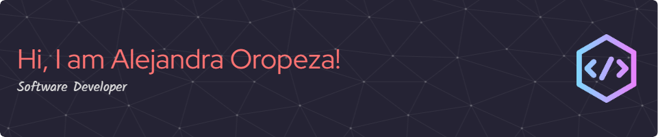

- 👩🏽‍💻 Software Developer 
- 🎓 Member of 42 Málaga 
- 📚 Currently learning Python 
- 🔎 Searching job as Software Developer 

## 💻 Tech Stack:

### ⌨ Languages 
        

### 🖼 Frameworks 

### 🛠 Tools 
            

## 📊 GitHub Stats:

 
 

<!-- Proudly created with GPRM ( https://gprm.itsvg.in ) -->
